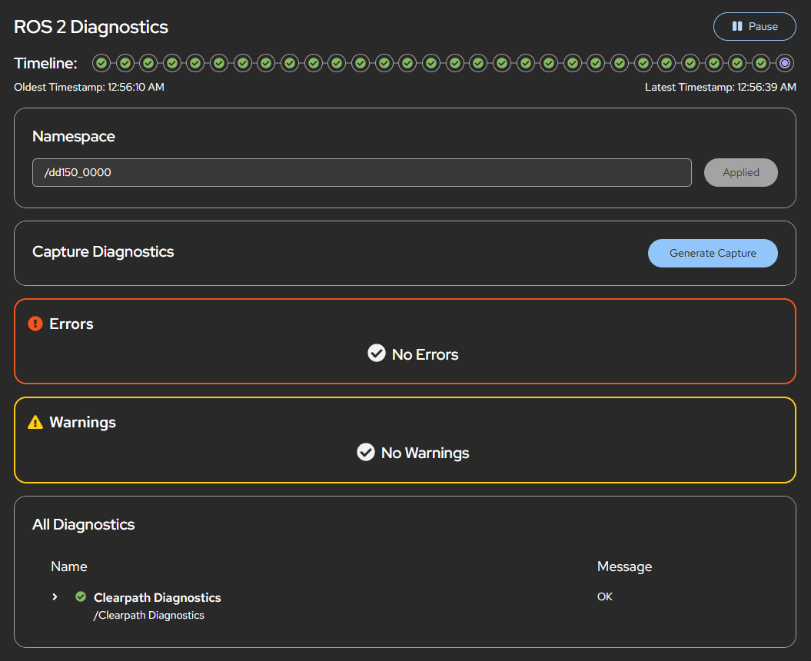

# Cockpit ROS 2 Diagnostics

This is a Cockpit application that is intended to be installed alongside [Cockpit](https://cockpit-project.org/) and connects to the [foxglove bridge](https://docs.foxglove.dev/docs/connecting-to-data/ros-foxglove-bridge)

This application is built on the Cockpit starter kit (https://github.com/cockpit-project/starter-kit) and using modified code files from https://github.com/tier4/roslibjs-foxglove.



# Installation instructions

This is installed and running automatically on Clearpath Robots without any manual installation required. For all other ROS computers, proceed with the following instructions.

The following instructions should be completed on the computer that is to be monitored and managed using the Cockpit interface. In most cases this will be the robot computer.

1. Install cockpit: https://cockpit-project.org/running.html#ubuntu

2. Add the Clearpath Robotics Package Server:

    ```bash
    wget https://packages.clearpathrobotics.com/public.key -O - | sudo apt-key add -
    sudo sh -c 'echo "deb https://packages.clearpathrobotics.com/stable/ubuntu $(lsb_release -cs) main" > /etc/apt/sources.list.d/clearpath-latest.list'
    sudo apt update
    ```

3. Install this module and the Foxglove bridge

    ```bash
    sudo apt install cockpit-ros2-diagnostics ros-$ROS_DISTRO-foxglove-bridge
    ```

4. In order to open the UI on a remote computer and connect to the Foxglove bridge, an unsecured connection (http) must be used. Allow an unencrypted HTTP connection by creating the [cockpit.conf](https://cockpit-project.org/guide/latest/cockpit.conf.5) file and set `AllowUnencrypted=true` in the `WebService` section. This is all done by running the following command:

    ```bash
    echo "[WebService]
    AllowUnencrypted=true" | sudo tee /etc/cockpit/cockpit.conf
    ```

# Usage Instructions

1. If not using a Clearpath Robot then you will need to start your [Foxglove bridge](https://docs.foxglove.dev/docs/connecting-to-data/ros-foxglove-bridge) manually. It must be launched with the default port (8765):

    ```bash
    ros2 launch foxglove_bridge foxglove_bridge_launch.xml
    ```

2. Open a [supported browser](https://cockpit-project.org/running) and go to `http://<ip-address>:9090` but replace `<ip-address>` with the ip address or hostname of your robot computer. Remember to use the IP address for the network over which you are connecting to the robot. In order for the websocket connection to work and successfully receive the ROS 2 topics, cockpit must be accessed over http, which is an unsecure connection. **Setting up a secure connection over https is currently unsupported**, but contributions are welcome.

3. Go to the ROS 2 Diagnostics tab.

# Development and Source Instructions

## Development dependencies

On Ubuntu:

    sudo apt install gettext nodejs npm make

## Getting and building the source

These commands check out the source and build it into the `dist/` directory:

```bash
git clone https://github.com/clearpathrobotics/cockpit-ros2-diagnostics.git
cd cockpit-ros2-diagnostics
make
```

## Installing

`make install` compiles and installs the package in `/usr/local/share/cockpit/`. The
convenience targets `srpm` and `rpm` build the source and binary rpms,
respectively. Both of these make use of the `dist` target, which is used
to generate the distribution tarball. In `production` mode, source files are
automatically minified and compressed. Set `NODE_ENV=production` if you want to
duplicate this behavior.

For development, you usually want to run your module straight out of the git
tree. To do that, run `make devel-install`, which links your checkout to the
location were cockpit-bridge looks for packages. If you prefer to do
this manually:

```bash
mkdir -p ~/.local/share/cockpit
ln -s `pwd`/dist ~/.local/share/cockpit/cockpit-ros2-diagnostics
```

After changing the code and running `make` again, reload the Cockpit page in
your browser.

You can also use
[watch mode](https://esbuild.github.io/api/#watch) to
automatically update the bundle on every code change with

    ./build.js -w

or

    make watch

When developing against a virtual machine, watch mode can also automatically upload
the code changes by setting the `RSYNC` environment variable to
the remote hostname.

    RSYNC=c make watch

When developing against a remote host as a normal user, `RSYNC_DEVEL` can be
set to upload code changes to `~/.local/share/cockpit/` instead of
`/usr/local`.

    RSYNC_DEVEL=example.com make watch

To "uninstall" the locally installed version, run `make devel-uninstall`, or
remove manually the symlink:

    rm ~/.local/share/cockpit/cockpit-ros2-diagnostics

## Running eslint

Cockpit Starter Kit uses [ESLint](https://eslint.org/) to automatically check
JavaScript/TypeScript code style in `.js[x]` and `.ts[x]` files.

eslint is executed as part of `test/static-code`, aka. `make codecheck`.

For developer convenience, the ESLint can be started explicitly by:

    npm run eslint

Violations of some rules can be fixed automatically by:

    npm run eslint:fix

Rules configuration can be found in the `.eslintrc.json` file.

## Running stylelint

Cockpit uses [Stylelint](https://stylelint.io/) to automatically check CSS code
style in `.css` and `scss` files.

styleint is executed as part of `test/static-code`, aka. `make codecheck`.

For developer convenience, the Stylelint can be started explicitly by:

    npm run stylelint

Violations of some rules can be fixed automatically by:

    npm run stylelint:fix

Rules configuration can be found in the `.stylelintrc.json` file.

## Running tests locally

** **These tests are still under development** **

To run the tests locally you must install:

    ```bash
    sudo apt install chromium-browser chromium-chromedriver
    sudo snap install chomium
    ```

Run `make check` to build a package, install it into a standard Cockpit test VM
(set to Ubuntu for this repo), and run the test/check-application integration test on
it. This uses Cockpit's Chrome DevTools Protocol based browser tests, through a
Python API abstraction. Note that this API is not guaranteed to be stable, so
if you run into failures and don't want to adjust tests, consider checking out
Cockpit's test/common from a tag instead of main (see the `test/common`
target in `Makefile`).

After the test VM is prepared, you can manually run the test without rebuilding
the VM, possibly with extra options for tracing and halting on test failures
(for interactive debugging):

    TEST_OS=centos-9-stream test/check-application -tvs

It is possible to setup the test environment without running the tests:

    TEST_OS=centos-9-stream make prepare-check

You can also run the test against a different Cockpit image, for example:

    TEST_OS=fedora-40 make check
